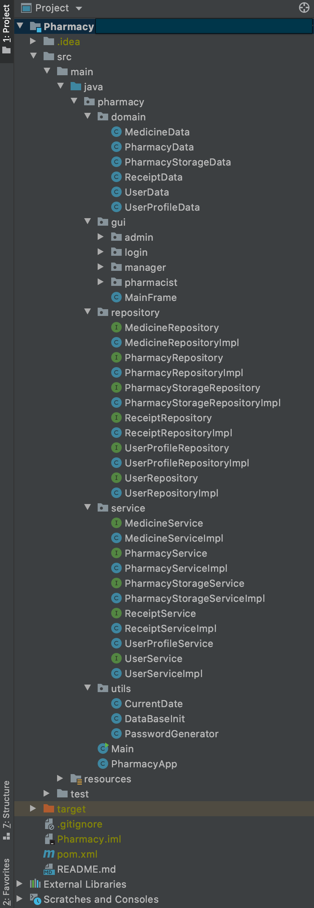
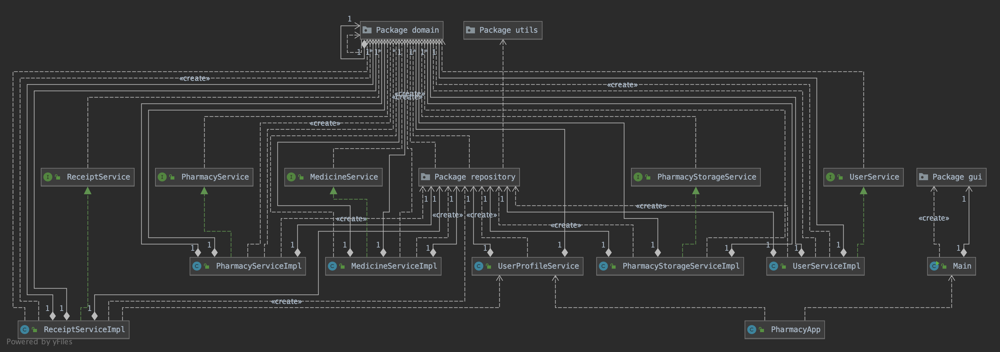
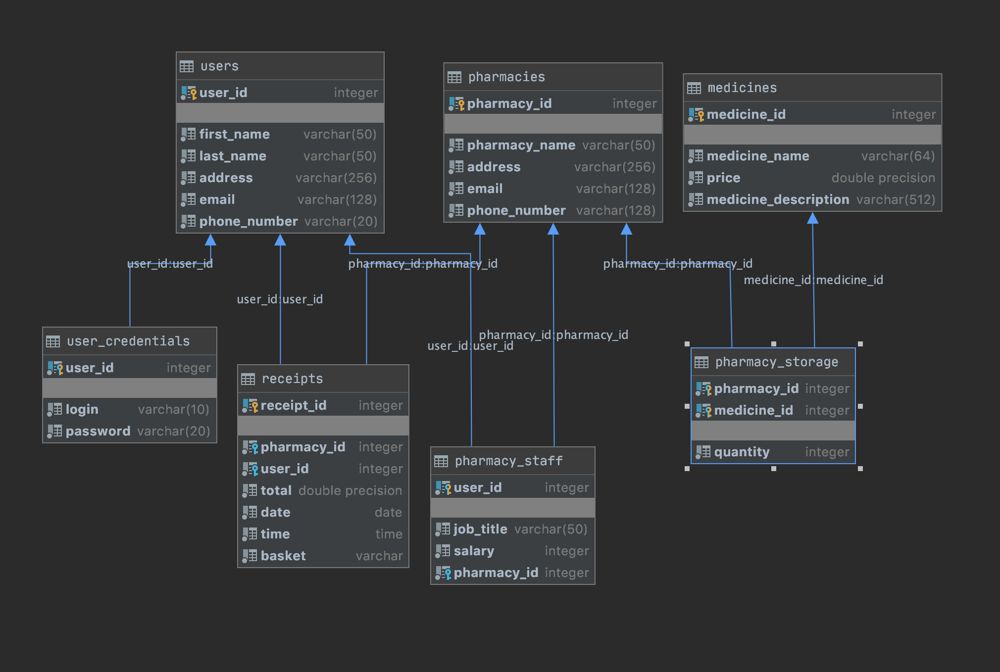

# Pharmacy

System that allows running a pharmacy

## Business needs
- 3 levels of access (admin, unit manager, pharmacist)
- Pharmacist: 
    - sale mode
- Unit Manager:
    - list of all team members (+ check the details option)
    - updates on a quantity of medicines in storage
    - receipt quick-preview
    - sales check
- Admin:
    - CRUD for all entities
    
## Tech Stack
- Java 8
- Maven
- JUnit 4
- PostgreSQL
- GUI: Swing
- ElephantSQL
- pgAdmin 4
- IDE: Intellij IDEA
- GitHub

## Project Structure

#

#
## UML Diagram

## A little sneak peek at GUI
### Login Panel

### PharmacistPanel (Sale Mode)

### ManagerPanel

### AdminMenu

### AdminPharmacy

### AdminUpdateUser

### AdminShowUsers

